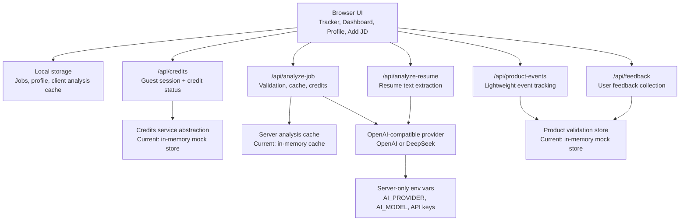

# AI Bilingual Job Search Analytics Platform

A local-first AI job application management platform for Chinese-speaking international students applying for English-speaking roles in Australia, Singapore, and China.

The app helps students paste job descriptions, generate evidence-based AI analysis, decide which jobs are worth applying to, understand skill gaps, tailor resumes, and manage applications in a spreadsheet-style tracker.

Product positioning: From job tracker to bilingual AI job search analytics platform.

## Live Demo

Live Demo: https://ai-bilingual-job-tracker.vercel.app

## Screenshots

Screenshots are not committed yet. Recommended portfolio screenshots:

- Tracker desktop table and mobile job cards
- Dashboard analytics
- Job detail analysis page
- Candidate profile page
- Demo Mode and guest credits banner

After the visual refresh, retake screenshots so the portfolio shows the current polished navigation, compact tracker intro, refined table, mobile cards, and dashboard/detail hierarchy.

## Target Users

- Chinese-speaking international students applying for analyst, consulting, product operations, risk, FinTech, and business roles
- Early-career candidates who need to compare job fit and tailor English resumes
- Portfolio reviewers who want to evaluate a practical local-first AI product workflow

## Key Features

- Spreadsheet-style job tracker with search, filters, sorting, clickable rows, row hover states, and status updates
- Multi-select jobs, batch status update, batch delete with confirmation, and CSV export
- Filters for high-match jobs, jobs needing action, and approaching deadlines
- Add Job workflow for source URL, pasted JD text, deadline, channel, contacts, interview date, notes, and follow-up notes
- Editable candidate profile saved locally and used for AI match scoring
- Resume upload on the Profile page to generate a candidate profile draft from `.docx` or text-based `.pdf` resumes
- Evidence-based AI analysis with match score breakdown, JD evidence, candidate gaps, confidence levels, red flags, and positive signals
- Recommended next action: apply now, tailor resume first, save for later, skip, or improve skills before applying
- Skill gap analysis with matched skills, missing skills, required tools, resume keywords, learning actions, and missing-skill priority
- Decision-focused job detail page with status timeline, notes, requirements, responsibilities, and collapsed raw JD text
- Dashboard analytics for application funnel, role types, average match by role, top skills, missing skills, tools, regions, and high-priority jobs
- English / Simplified Chinese UI toggle with static translation dictionaries
- Demo sample data for review without calling the AI API
- Demo Mode indicator when real AI analysis is unavailable
- Anonymous guest credits for controlled public demo usage
- Feedback page and lightweight product event tracking for validation MVP learning
- Mobile card layout for job records while keeping the desktop spreadsheet table
- Basic PWA manifest and install metadata
- Server-only AI provider abstraction for OpenAI-compatible providers including OpenAI and DeepSeek

## Tech Stack

- Next.js App Router
- TypeScript
- Tailwind CSS
- Local storage persistence
- OpenAI-compatible chat completions API abstraction
- Resume text extraction with Mammoth for Word `.docx` files and pdf-parse for text-based PDFs
- Lightweight custom table and dashboard visual blocks
- Windows local-app launcher scripts for one-click local use

## Architecture



## AI Analysis Workflow

1. The user pastes a job description on the Add Job page.
2. The frontend loads the saved candidate profile from local storage.
3. The app sends the JD, source URL reference, and candidate profile to `/api/analyze-job`.
4. The server-side provider calls the configured AI model and asks for JSON-only output.
5. The response is normalized for backward compatibility with older saved jobs.
6. The job record is saved locally and opened on the detail page.

The API key is only read on the server side. It is never exposed to browser code.

## Resume-to-Profile Workflow

1. The user opens the Profile page and uploads a `.docx` resume or a text-based `.pdf`.
2. The server extracts plain text from the resume.
3. The app sends the extracted text and current saved profile to `/api/analyze-resume`.
4. The AI returns a candidate profile draft, bilingual summaries, extracted strengths, unclear information, and confidence level.
5. The user reviews the draft and clicks `Apply to Profile` only if they want to save it locally.

The original resume file is not saved by the app. Only the user-approved candidate profile is persisted in local storage. V1 does not support scanned PDFs or OCR.

## Candidate Profile Personalization

The Profile page stores local candidate preferences used in AI scoring:

- Target regions
- Target roles
- Education background
- Degree direction
- Technical skills
- Business skills
- Tools
- Work experience
- Work rights / visa status
- Preferred industries
- Preferred language
- Career goals

Users can also generate a draft profile from an uploaded resume and then manually edit it before saving.

Default profile:

- Chinese-speaking international student
- Bachelor background in Statistics
- Master direction in Business Analytics and FinTech
- Target regions: Australia, Singapore, China
- Target roles: Data Analyst, Business Analyst, Product Operations, Risk Strategy, Consulting, FinTech
- Skills: SQL, Python, Excel, Power BI, data analysis, report writing, questionnaire analysis, consulting research
- Experience: FMCG quantitative research, consulting project work, transcript cleaning, insight memo writing
- Work rights: international student

## Match Scoring Logic

The AI returns a 0-100 match score and six dimensions:

- Education fit
- Technical skills fit
- Business / communication fit
- Experience fit
- Career direction fit
- Location / international student suitability

Each dimension includes a score, explanation, evidence from the JD, candidate gap, and confidence level.

The score should increase when a role fits analytics, product operations, risk, consulting, FinTech, or early-career business roles. It should decrease when the JD requires many years of experience, missing work rights, unclear sponsorship fit, or skills far outside the profile.

## API Cost Control

- AI output is requested as concise JSON only.
- JD analysis enforces a minimum text length and a maximum JD length of 12,000 characters.
- Resume text is shortened before AI analysis if it is very long.
- The app caches analyses in local storage using the normalized JD and candidate profile.
- Re-analyzing the same unchanged JD with the same profile reuses cached analysis.
- `/api/analyze-job` also checks a server-side cache before calling the AI provider.
- Anonymous guest credits are checked on the server before real AI analysis runs.
- Credits are only consumed for successful, uncached JD analyses.
- Credits are not consumed when the AI call fails, when sample data is loaded, or when a cached duplicate analysis is reused.
- The source URL is saved only as a reference; the app does not scrape protected job boards.
- Future production hardening should add IP-based guest creation limits and server-side rate limiting.

## Demo Mode and Sample Data

The deployed app is usable without an API key. When no supported provider key is configured, the UI shows Demo Mode:

```text
Demo mode is active. You can explore sample jobs, dashboard analytics, and profile features. Configure an API key to run real AI JD analysis.
```

```text
当前为演示模式。你可以查看示例岗位、仪表盘分析和候选人画像。如需真实 AI 岗位分析，请配置 API Key。
```

In Demo Mode, reviewers can:

1. Open the tracker.
2. Click `Load sample data`.
3. Review the dashboard, tracker, job detail page, profile page, edit flow, filters, batch actions, CSV export, and timeline.

You can also test the Add Job workflow with:

```text
samples/sample-jd.txt
```

Without an API key, the Analyze JD flow shows a friendly message instead of calling a provider or crashing.

## Guest Credits

Each anonymous browser session receives 10 free guest credits.

- Analyzing 1 uncached JD costs 1 credit.
- Loading demo sample data costs 0 credits.
- Reusing cached analysis for the same JD and same candidate profile costs 0 credits.
- Failed AI provider calls are refunded and do not consume credits.
- When credits are exhausted, real AI JD analysis is blocked with a bilingual message.

Current implementation:

- A secure, HTTP-only session cookie stores the anonymous guest ID.
- A server-side credits service abstraction enforces credits in `/api/analyze-job`.
- The current adapter is an in-memory mock store suitable for local development and lightweight demos.

Production limitation: in-memory credits are not durable across Vercel serverless instance restarts or multiple regions. Plug in Supabase, Vercel KV, or Upstash Redis before relying on credits for production-grade enforcement.

## Validation MVP Layer

The next product phase is focused on learning from real users before adding heavier features.

Current implementation:

- A `/feedback` page collects structured qualitative feedback from reviewers and early users.
- `/api/feedback` validates submissions server-side and records them through a product validation service abstraction.
- `/api/product-events` accepts lightweight product events for key actions such as loading demo data, clicking Analyze JD, exporting CSV, opening job details, and saving analyzed jobs.
- Client-side event tracking is fire-and-forget. If the request fails, recent events are queued in local storage so the product flow is not blocked.

Current limitation:

- Feedback and product events use an in-memory mock store and server logs. This is useful for local validation and implementation shape, but it is not durable on Vercel serverless infrastructure.

Recommended production upgrade:

- Add Supabase tables for `product_events` and `feedback`.
- Store anonymous `guest_id`, event name, path, language, timestamp, and safe event properties.
- Keep feedback free of private resume content and avoid storing sensitive personal details.
- Add an admin-only export or dashboard after enough early feedback exists.

## Mobile and PWA

- Desktop keeps the spreadsheet-style tracker table.
- Mobile shows clickable job cards with company, title, match score, recommendation, status, deadline, and next action.
- Dashboard and detail sections stack vertically on small screens.
- The app includes a web app manifest, theme color, and placeholder app icon so supported browsers can add it to the home screen.
- No service worker is included yet; offline AI analysis is intentionally not supported.

## Run Locally

```bash
pnpm install
pnpm dev
```

Open [http://localhost:3000](http://localhost:3000).

## Deploy on Vercel

1. Push the repository to GitHub.
2. In Vercel, create a new project and import the repository.
3. Keep the default Next.js framework settings.
4. Set environment variables only if real AI analysis should be enabled.
5. Deploy.

Recommended public portfolio setup:

- Leave `OPENAI_API_KEY` and `DEEPSEEK_API_KEY` unset for a safe Demo Mode deployment.
- Use sample data to let reviewers explore the tracker, dashboard, job detail page, candidate profile, edit flow, and CSV export.
- Add an API key only when you are ready to pay for real public AI usage.

Cost warning: if real AI analysis is enabled on a public deployment, visitors can trigger provider calls. Guest credits and JD limits reduce risk, but persistent storage and server-side rate limiting should be added before broad public launch.

## Windows Local Launcher

For day-to-day local use on Windows, double-click:

```text
open-job-tracker-windows.vbs
```

This starts the local Next.js server quietly in the background and opens [http://127.0.0.1:3000](http://127.0.0.1:3000).

When finished, double-click:

```text
stop-job-tracker-windows.vbs
```

Launcher logs are stored in `.localappdata`, which is ignored by Git.

## Environment Variables

Create `.env.local` in the project root for local development, or set the same variables in Vercel Project Settings. Never commit real keys.

All API keys are server-only. Do not prefix them with `NEXT_PUBLIC_`.

Required only for real AI analysis:

OpenAI example:

```bash
AI_PROVIDER=openai
AI_MODEL=gpt-5-mini
OPENAI_API_KEY=your_openai_api_key_here
```

DeepSeek example:

```bash
AI_PROVIDER=deepseek
AI_MODEL=deepseek-chat
DEEPSEEK_API_KEY=your_deepseek_api_key_here
```

Demo Mode setup:

```bash
AI_PROVIDER=openai
AI_MODEL=gpt-5-mini
# Leave OPENAI_API_KEY and DEEPSEEK_API_KEY unset
```

## Useful Commands

```bash
pnpm lint
pnpm build
```

## Limitations

- Local-first persistence; jobs and profile data are stored in the browser.
- Guest credits need a persistent backend for production-grade enforcement.
- No login
- No payment
- No browser extension
- No scraping LinkedIn, Seek, Indeed, or other protected job boards
- Source URLs are saved only as references
- Uploaded resume files are used for one-time server-side text extraction and are not stored by the app
- No user-uploaded resume parsing beyond the existing `.docx` and text-based `.pdf` profile draft flow
- API keys must stay in `.env.local` and server-side environment variables only

## Roadmap

- Supabase persistence
- Login system
- Persistent guest credits
- Resume tailoring workspace
- Calendar reminders
- Mobile app wrapper / PWA improvements
- CSV import and backup restore
- More robust AI JSON validation with schema tooling
- OCR support for scanned PDF resumes
- Cover letter draft helper
